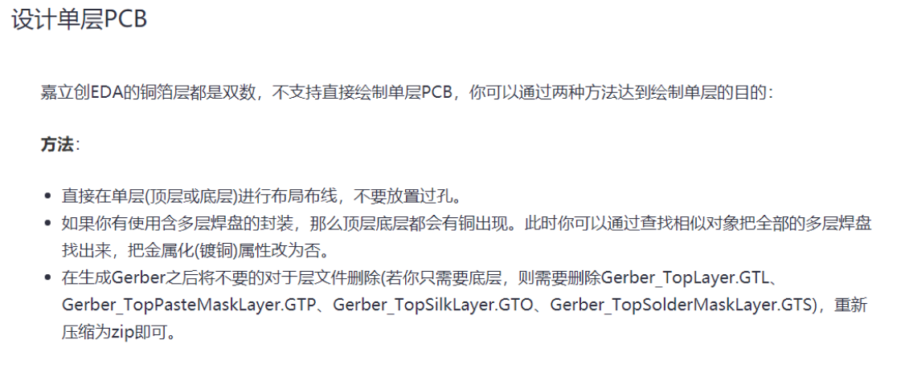
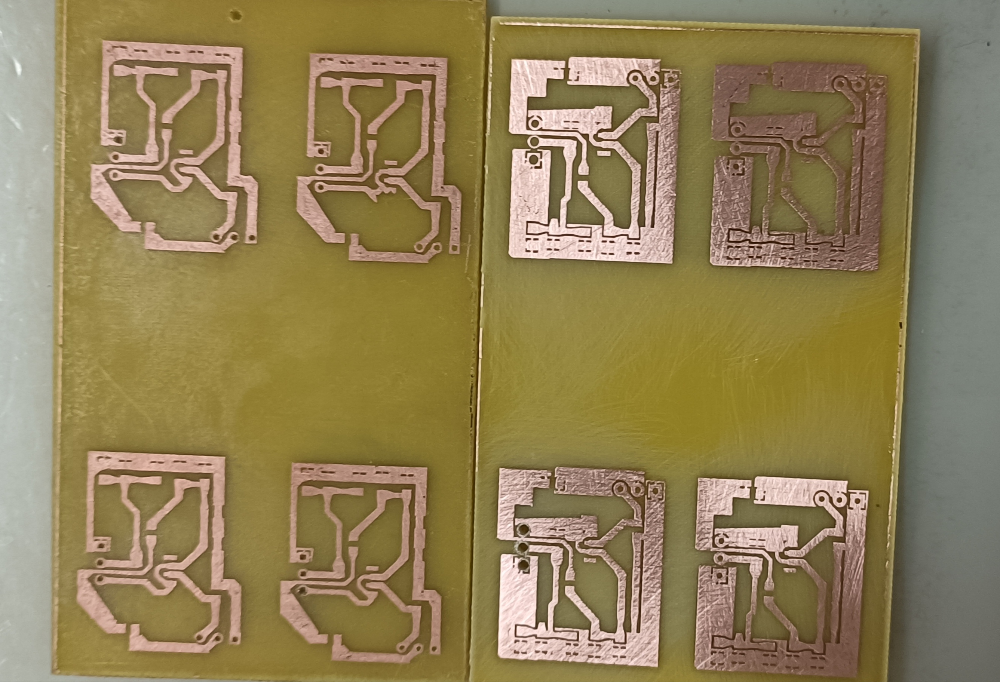
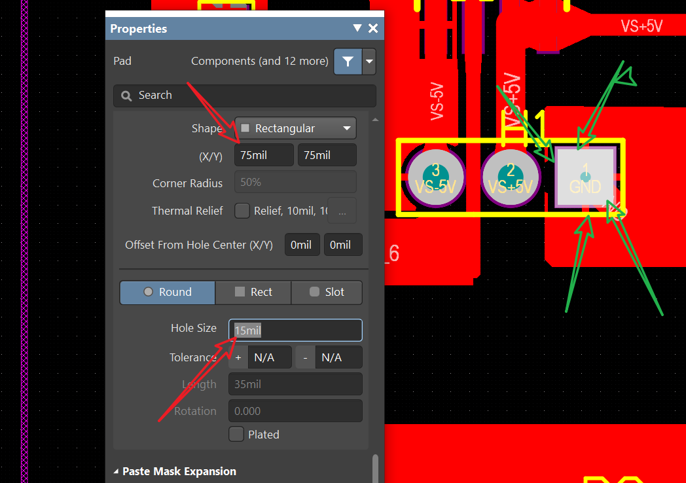
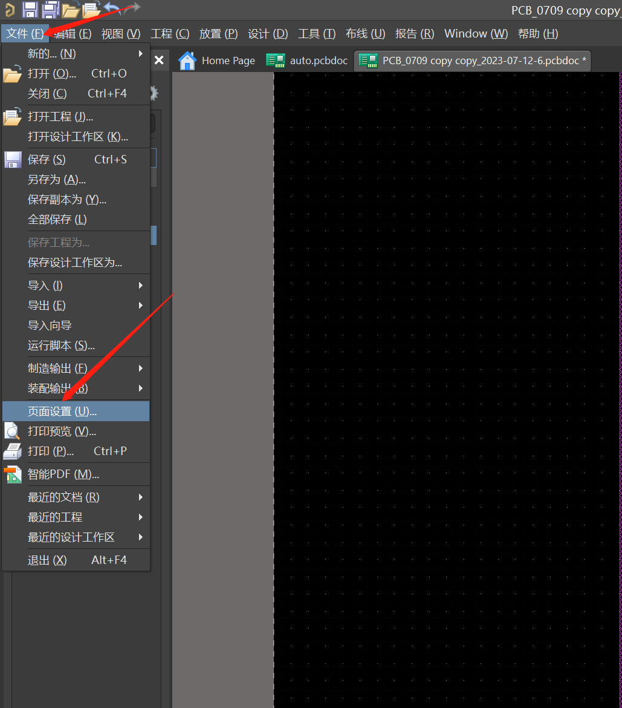
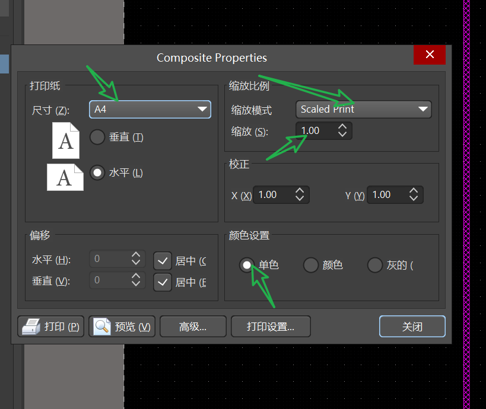
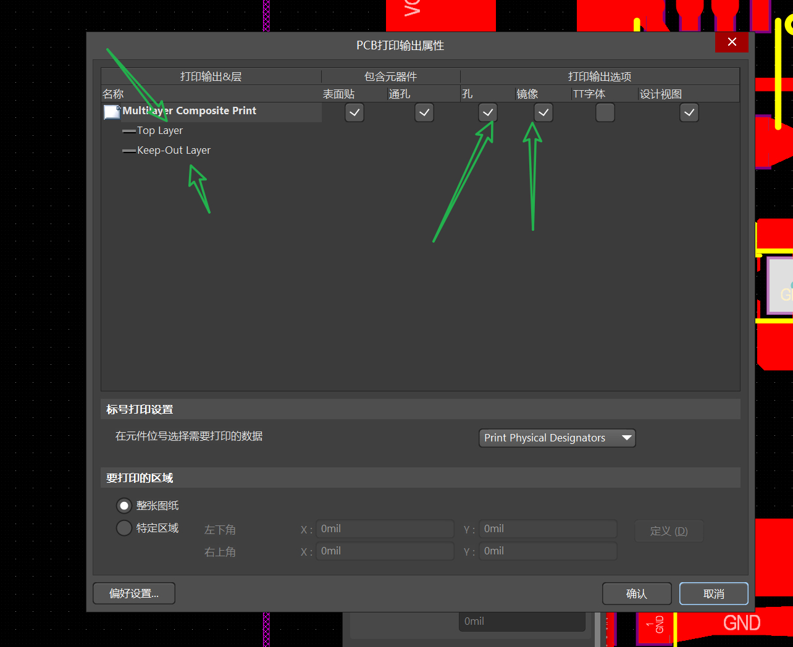

## PCB制作
采用立创EDA

    额外步骤
    0：往大去做！！！(搞清楚原理，实验室单层板制版机的原理是在电路板面上布线，所以会有短路风险！尺寸40mil++，间距扩大！往大的做！)
    1：尺寸选为6*10（cm）;往大而宽松去做！不必考虑间距（2.54mm排针等），可以用导线连！！重要！
    2：注意打好标记，覆铜处理，多覆铜没问题的;
    3：各种标签的铜覆盖好之后，转到AD
    4：孔，特别是排插，以下面这样的尺寸设计较好
    5：设计完成后转AD，打印设置如下

不完美的制板图如下

### 孔的设计

    中间的小了可以钻大，但大了就会导致链接不均匀
    由于我们的板子一般很小，所以可以设置多个，比如一张纸打印四个，那2个孔用80min*2，,2个用70mil*2即可

### AD打印设置
    第一步，进入设置界面

    第二步，设置截图

#### 非常重要！
#### 非常重要！

    然后进入"高级"

### 热转印，制板

    热转印纸在抽屉里的书籍区

#### 需要准备的物资
    1:热转印纸；
    2：抗高温胶带；
    3：砂纸，打磨用；2，3都在工具区；
    4：钻台，实验室有一大一小2个直径的；
    5：电路板，6*10cm；在工具区；
    6：重要！！！提前15min打开转印机，设置190°C，预热需要很久；
    7：腐蚀液也需要预热几分钟，可以在转印机150°C时开始。

#### 实操步骤

    1：仔细对齐，用热转印纸包裹好
    2：贴好抗热胶带；
    3：用力！！！塞入热转印机，转印机开启前进模式
    4：趁热打铁，转完就拆开（用镊子！！很烫），补漆（一般不需要）
    5：钻孔，用腐蚀液机子的绳子帮助
    6：腐蚀液机子设置：右下角的显影设置，第一页液动控制用A 第二页温度控制用B。
    7：腐蚀10-15min即可；
    8：不伤手，可以戴手套，拿出来后带着一块砂纸，去水房打磨
    9：打磨完，晾干，打孔；
    10：松香水或者助焊油，焊接！

